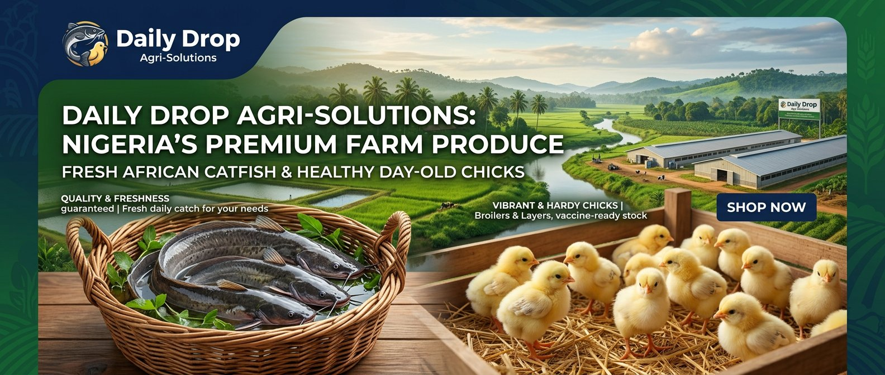

# 🐟🐔 Daily Drop Agri-Solutions — E-Commerce Website

> Nigeria's online fish & poultry marketplace. Buy live catfish, broiler chicks, point-of-lay pullets, and premium aquaculture feed — direct from farm to your pond.



## 🚀 Live Demo

**[dailydrop.ng](https://dailydrop.ng)** *(coming soon)*

## ✨ Features

| Feature | Description |
|---------|-------------|
| 🐟 **Live Catfish Market** | 6 products — juveniles to table-size with real photos |
| 🐔 **Poultry Section** | Day-old chicks, POL pullets, turkey poults, feed |
| 📱 **Mobile App Mode** | Bottom nav, installable PWA, no browser chrome |
| 🛒 **Smart Cart** | localStorage-persisted cart with WhatsApp checkout |
| 📊 **Live Metrics** | Real order counters stored in localStorage |
| 🎬 **Motion Design** | Scroll reveals, hover animations, hero slider |
| 🔍 **SEO Optimized** | Open Graph, Twitter Cards, JSON-LD structured data |
| 💬 **WhatsApp Integration** | Floating button + cart-to-WhatsApp ordering |
| 📞 **One-Tap Calling** | Direct phone call from any device |
| ♿ **Accessible** | ARIA labels, semantic HTML, keyboard navigation |

## 🛠️ Tech Stack

- **HTML5** — Semantic markup with `<section>`, `<nav>`, `<main>`
- **CSS3** — Custom properties, Grid, Flexbox, animations
- **Vanilla JS** — No frameworks, zero dependencies
- **Fonts** — Poppins + Inter via Google Fonts
- **Icons** — Font Awesome 6.5

## 📂 Project Structure

```
├── index.html              # Main application (single file)
├── manifest.json           # PWA manifest for "Add to Home Screen"
├── og-image.jpg            # Social media preview image
├── fish1.jpg – fish6.jpg   # Catfish product photos
├── poultry1.jpg – poultry5.jpg  # Poultry product photos
├── feed1.jpg – feed2.jpg   # Fish feed product photos
├── hero-banner.jpg         # Hero section background
├── CUSTOMER_OUTREACH_STRATEGY.md  # Marketing playbook
├── .gitignore
└── README.md
```

## 🚀 Quick Start

```bash
# Clone
git clone https://github.com/yourusername/daily-drop-agri.git
cd daily-drop-agri

# Serve locally
python3 -m http.server 8080
# or
npx serve .

# Open
open http://localhost:8080
```

## 📱 Install as App

1. Open on your phone browser
2. Tap **Share** → **"Add to Home Screen"**
3. Opens like a native app (no browser bars)

## 🏷️ SEO & Metadata

- **Title**: `Daily Drop Agri-Solutions | Buy Live Catfish, Poultry Chicks & Fish Feed in Lagos Nigeria`
- **Open Graph**: Full Facebook/WhatsApp preview
- **Twitter Cards**: Large image card
- **JSON-LD**: LocalBusiness + OfferCatalog + BreadcrumbList
- **Canonical URL**: `https://dailydrop.ng/`

## 📈 Customer Outreach

See [CUSTOMER_OUTREACH_STRATEGY.md](CUSTOMER_OUTREACH_STRATEGY.md) for:
- 5 Facebook groups (12,800+ CAFAN members)
- 3 Nairaland forum threads
- 5 WhatsApp farmer groups
- 5 online marketplaces
- Ready-to-copy invitation posts

## 📄 License

© 2026 Daily Drop Agri-Solutions. All rights reserved.

---

Built with 💚 for Nigerian farmers by [Goodluck Gary](tel:+2349126480004)
